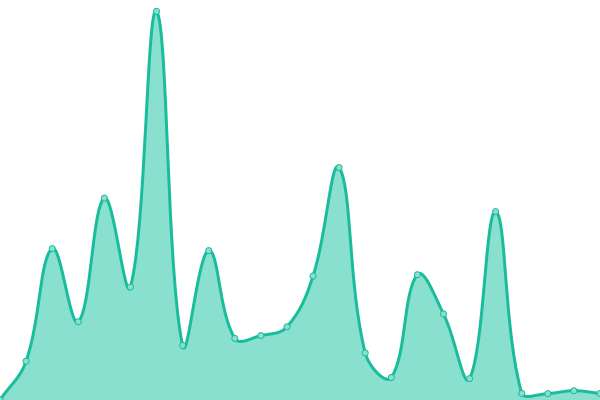
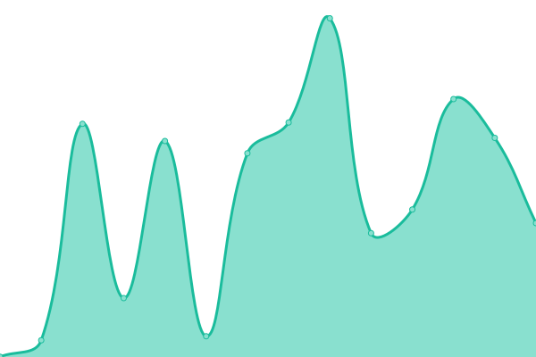

# [📈 Live Status](https://up.chik4ge.me): <!--live status--> **🟩 All systems operational**

This repository contains the open-source uptime monitor and status page for [chik4ge-homelab](https://up.chik4ge.me), powered by [Upptime](https://github.com/upptime/upptime).

With [Upptime](https://up.chik4ge.me), you can get your own unlimited and free uptime monitor and status page, powered entirely by a GitHub repository. We use [Issues](https://github.com/chik4ge-homelab/upptime/issues) as incident reports, [Actions](https://github.com/chik4ge-homelab/upptime/actions) as uptime monitors, and [Pages](https://up.chik4ge.me) for the status page.

<!--start: status pages-->
<!-- This summary is generated by Upptime (https://github.com/upptime/upptime) -->
<!-- Do not edit this manually, your changes will be overwritten -->
<!-- prettier-ignore -->
| URL | Status | History | Response Time | Uptime |
| --- | ------ | ------- | ------------- | ------ |
|  [Argo CD](https://argocd.chik4ge.me) | 🟩 Up | [argo-cd.yml](https://github.com/chik4ge-homelab/upptime/commits/HEAD/history/argo-cd.yml) | 

 588ms
     
 | 

<a href="https://up.chik4ge.me/history/argo-cd">100.00%</a>
    

|  [Proxmox VE](https://proxmox.chik4ge.me) | 🟩 Up | [proxmox-ve.yml](https://github.com/chik4ge-homelab/upptime/commits/HEAD/history/proxmox-ve.yml) | 

 569ms
     
 | 

<a href="https://up.chik4ge.me/history/proxmox-ve">100.00%</a>
    

|  [Grafana](https://grafana.chik4ge.me) | 🟩 Up | [grafana.yml](https://github.com/chik4ge-homelab/upptime/commits/HEAD/history/grafana.yml) | 

 747ms
     
 | 

<a href="https://up.chik4ge.me/history/grafana">100.00%</a>
    

|  [Alloy](https://alloy.chik4ge.me) | 🟩 Up | [alloy.yml](https://github.com/chik4ge-homelab/upptime/commits/HEAD/history/alloy.yml) | 

 1301ms
     
 | 

<a href="https://up.chik4ge.me/history/alloy">100.00%</a>
    

|  CUBE cocricot Server | 🟩 Up | [cube-cocricot-server.yml](https://github.com/chik4ge-homelab/upptime/commits/HEAD/history/cube-cocricot-server.yml) | 

 151ms
     
 | 

<a href="https://up.chik4ge.me/history/cube-cocricot-server">100.00%</a>
    

|  CUBE cocricot Map | 🟩 Up | [cube-cocricot-map.yml](https://github.com/chik4ge-homelab/upptime/commits/HEAD/history/cube-cocricot-map.yml) | 

 709ms
     
 | 

<a href="https://up.chik4ge.me/history/cube-cocricot-map">100.00%</a>
    

|  CUBE MiniaTuria Server | 🟩 Up | [cube-minia-turia-server.yml](https://github.com/chik4ge-homelab/upptime/commits/HEAD/history/cube-minia-turia-server.yml) | 

 151ms
     
 | 

<a href="https://up.chik4ge.me/history/cube-minia-turia-server">100.00%</a>
    

|  CUBE MiniaTuria Map | 🟩 Up | [cube-minia-turia-map.yml](https://github.com/chik4ge-homelab/upptime/commits/HEAD/history/cube-minia-turia-map.yml) | 

 370ms
     
 | 

<a href="https://up.chik4ge.me/history/cube-minia-turia-map">100.00%</a>
    

<!--end: status pages-->

[**Visit our status website →**](https://up.chik4ge.me)

## 📄 License

- Powered by: [Upptime](https://github.com/upptime/upptime)
- Code: [MIT](./LICENSE) © [Anand Chowdhary](https://anandchowdhary.com), supported by [Pabio](https://pabio.com)
- Data in the `./history` directory: [Open Database License](https://opendatacommons.org/licenses/odbl/1-0/)
